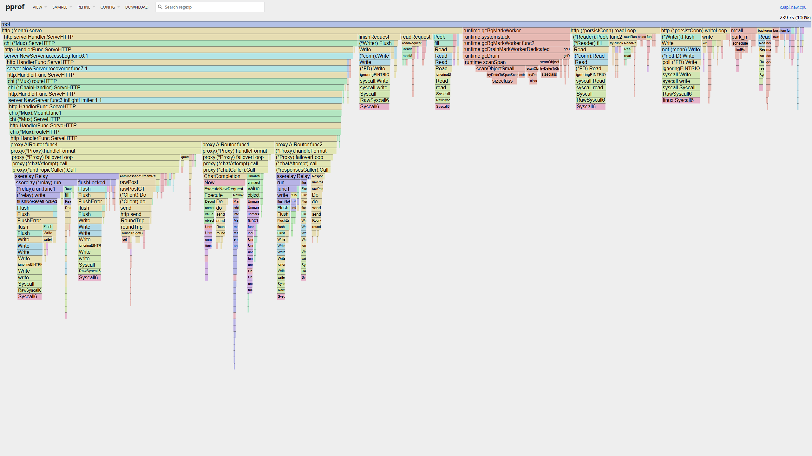

<div align="center">

# ⚡ C4

**C4 轻量 AI 网关**——一个入口统一接入 OpenAI Responses API、Anthropic Messages API 与 OpenAI Chat Completions API，内置管理台、用量统计与计费。

[English](./README.md) | [中文](./README_zh.md)

[](https://github.com/baimao5299-ship-it/c4/releases)
[](https://github.com/baimao5299-ship-it/c4)
[](./LICENSE)
[](https://go.dev/)

[](https://platform.openai.com/docs/api-reference/responses)
[](https://docs.anthropic.com/en/api/messages)
[](https://platform.openai.com/docs/api-reference/chat)

</div>

C4 在原网关基础上主要增加了这些实用功能：

- 兼容 Sub2API 的账号导入，支持多文件和 ZIP。
- 重复账号预检测、导入预览和详细失败原因。
- 可选的 Sub2 TLS 指纹与收敛设置。
- 故障切换按请求排除已失败账号，避免规则异步期间重复发送。
- 可扩展的供应商余额适配器，明确区分未配置、过期和真实余额。

网关核心架构仍沿用原版项目。

当前维护者：[baimao5299-ship-it](https://github.com/baimao5299-ship-it)。

## 状态：Beta

C4 处于 **beta**。当前 API 已可使用，但 beta 版本之间仍可能调整表结构和配置格式。

### 兼容说明

产品名称为 **C4**。为兼容已有部署，Go 模块路径（`github.com/is7qin/c3api`）、可执行文件/容器名称、API 路径以及 `C3API_*` 环境变量保持不变。

- **暂不提供自动迁移**——beta 版本之间不保证数据库表结构和配置兼容。
- **beta 升级按全新部署处理**——使用新的 `RemoteDir` 和数据库，重新核对配置后再切换流量。部署脚本默认拒绝复用已有数据库；只有完成表结构兼容性核对并显式传 `-ReuseDatabase` 才会继续。
- 发布说明见 [CHANGELOG.md](./CHANGELOG.md)。

## 特性

| | |
|---|---|
| **六格式一网关** | OpenAI Responses API（REST + WebSocket）、Anthropic Messages API、OpenAI Chat Completions API、OpenAI Images API、Codex 网页搜索与 OpenAI 兼容模型列表——各自独立的上游编排，分组支持自动协议协商 |
| **模板与账号管理** | 模型模板、上游账号、分组、凭证，以及按模板的格式/模型白名单 |
| **管理台** | React 前端内嵌进二进制（`/app`），另有 OpenAPI 契约定义的管理 API（`/api/admin`） |
| **计费与用量** | 用户余额预检扣费、FEFO 临时额度、litellm 价格同步的按模型计费、按日分区的用量日志与统计——计费默认开启（`config.example.toml` billing.enabled=true） |
| **规则引擎** | 可自定义的路由、限流与 429/错误退避规则，内置调度器 |
| **多实例就绪** | 状态全在 PostgreSQL，`NOTIFY` 跨实例失效广播，Redis 心跳实例发现（集群规模自动感知）——水平扩容零配置 |
| **单二进制** | Go 二进制内嵌前端，非 root 容器镜像，即插即用部署 |

### 请求格式

| 格式 | 端点 | 上游 |
|---|---|---|
| OpenAI Responses API | `POST /v1/responses` | OpenAI Responses（REST） |
| OpenAI Responses API — WebSocket | `WS /v1/responses`（带 upgrade 头的 GET） | OpenAI Responses WebSocket（如 Codex 客户端） |
| Anthropic Messages API | `POST /v1/messages` | Anthropic Messages（REST + SSE） |
| OpenAI Chat Completions API | `POST /v1/chat/completions` | OpenAI Chat Completions（REST + SSE） |
| OpenAI Images API | `POST /v1/images/generations` / `POST /v1/images/edits` | OpenAI Images（JSON + multipart，REST + SSE） |
| Codex 网页搜索 | `POST /v1/alpha/search` | Codex SDK Search（仅 Codex 客户端） |
| OpenAI 模型列表 | `GET /v1/models` | 调度器内存快照（零 DB） |

## 快速开始

### Docker Compose（推荐）

```bash
cp .env.example .env
# 在 .env 中填写 AUTH_JWT_SECRET、POSTGRES_PASSWORD 和 ADMIN_TOKEN。
docker compose up -d --build
```

这会在本地构建镜像，并一起启动 PostgreSQL、Redis 和 C4 网关。若要使用预构建镜像，先从 `compose.yml` 删除 `build:` 段，再运行 `docker compose pull` 和 `docker compose up -d`。

网关监听 `http://127.0.0.1:18080`——管理台 `/app`，用户台 `/user`，存活检查 `/healthz`，就绪检查（快照和已配置代理链路）`/readyz`。

**初始管理**——Compose 要求设置静态 `ADMIN_TOKEN`，并默认只绑定本机。打开 `/user/login`，切换到“管理员令牌”并粘贴生成的值；控制台会先用只读管理请求验证令牌，再进入 `/app`。公开注册始终是普通 `user`；要对其他机器开放，应放在 HTTPS 反向代理之后。

预构建镜像发布在 GHCR（`ghcr.io/baimao5299-ship-it/c4`）：`:beta` 跟随最新 beta 版本，也提供固定版本 tag。单独拉取：`docker pull ghcr.io/baimao5299-ship-it/c4:beta`。为兼容已有部署，旧的 `c3api` 镜像标签会同步发布。

### 本地开发

```bash
# 0. 注入本地开发密钥（config.toml 留空值；占位符如 change-me 会被 Load 拒绝）
export C3API_ADMIN_TOKEN=local-admin-token
export C3API_AUTH_JWT_SECRET=$(openssl rand -hex 16)

# 1. 启动网关（默认 :18080）
go run ./cmd/server -config config.toml

# 2. 启动前端 dev server（:5173，代理 /api 到 18080）
cd web && pnpm install && pnpm run dev
```

任意兼容 OpenAI/Anthropic 的 SDK 指向网关地址即可——请求格式由路径决定，一个 base URL 同时服务六种请求格式。

## 架构

```
                    ┌───────────────────────────────┐
 OpenAI SDK / curl ─▶│   C4 网关（单二进制）           │
 Anthropic SDK ─────▶│  ┌─────────────────────────┐  │
 Codex 客户端 ──────▶│  │ chi 路由                │  │──▶ OpenAI 上游（REST + SSE）
   浏览器（SPA） ───▶│  │ /healthz /readyz /api/admin /api/user + SPA / /user /app │  │──▶ Anthropic 上游（REST + SSE）
                    │  │ /v1/*                    │  │──▶ Responses / resp-ws 上游
                    │  │ proxy：鉴权 → 门禁 →      │  │
                    │  │         选号 → 转发       │  │
                    │  └──────────┬──────────────┘  │
                    │   workers：billing / usage /  │
                    │   errlog / scheduler / notify │
                    │   retention / stats-agg /     │
                    │   pricing-sync / rule-engine  │
                    │   auth-sync / invalidate /    │
                    │   discovery                   │
                    └───────┼───────────────┼──────┘
                            ▼               ▼
                  PostgreSQL 18（状态 + NOTIFY）│
                                             ▼
                      Redis 8（易失状态：协调 + 短时效验证码）
```

- **单二进制**：前端经 `go:embed` 内嵌，运行时 = 一个 `server` 进程 + 挂载的配置文件。
- **网关无状态、状态在 DB**：共享状态全部在 PostgreSQL，实例间经 `c3api_invalidate` 通道 `NOTIFY` 协调；多实例预算分摊基数 N 经 Redis 心跳自动发现——加实例即扩容（无手工设置）。
- **常驻 worker**：计费扣减、用量/统计落库、错误审计、分区保留、离线聚合、价格同步与规则调度均为长驻 worker，支持优雅停机排空。

## 性能

网关 30 秒 CPU profile（`go tool pprof -http=:8081 <profile.pprof>`）：



热点集中在 IO 与 GC，而非请求路径逻辑：

- **~23%** `syscall`——网络读写（上游连接、pgx）
- **~15%** GC——分配密集路径（span 分级 + 对象/span 扫描）
- **~4%** `selectgo`——并发等待；**~1%** `memmove`——数据拷贝

请求路径本身（JSON 解析、路由、配额/计费）只占 CPU 个位数百分比，吞吐留有富余。GC 调优钩子（`GOGC` / `GOMEMLIMIT`）已接入 compose 栈——见 `.env.example`。

## 配置

网关加载 `config.toml`（模板见 `config.example.toml`），`C3API_` 前缀环境变量可覆盖（前缀**必须大写**）：

| 变量 | 说明 |
|---|---|
| `C3API_ADMIN_TOKEN` | 管理端 token（Compose 模板必填；直接部署只有在明确配置可信 bootstrap 时才可留空） |
| `C3API_AUTH_JWT_SECRET` | 用户鉴权 JWT 密钥（必填；跨重启与多实例须稳定） |
| `C3API_AUTH_ALLOW_FIRST_USER_ADMIN` | 是否允许首个公开注册用户成为 `platform_admin`；新部署默认 `false` |
| `C3API_AUTH_LOGIN_RATE_PER_MINUTE` | 每实例按来源 IP 的登录次数上限（默认 `20`） |
| `C3API_AUTH_REGISTER_RATE_PER_MINUTE` | 每实例按来源 IP 的注册次数上限（默认 `5`） |
| `C3API_AUTH_CODE_RATE_PER_MINUTE` | 每实例按来源 IP 的验证码请求上限（默认 `3`） |
| `C3API_AUTH_RESET_RATE_PER_MINUTE` | 每实例按来源 IP 的重置密码请求上限（默认 `5`） |
| `C3API_DB_DSN` | PostgreSQL 连接串 |
| `C3API_REDIS_ADDR` | Redis 地址（必填；如 `127.0.0.1:6379`——实例发现、短时效验证码等易失状态） |

完整配置项（server / log / admin / auth / db / redis / proxy / upstream / limit / scheduler / usage / billing）见 `config.example.toml`。启动代理通过 `upstream.proxy_url` 指定：留空直连，支持 `http://`、`https://` 和 `socks5h://`；不会读取系统 `HTTP_PROXY`，代理失败也不会偷偷改走直连。运行中可在管理台“设置 → 网络代理”修改 `upstream_proxy_url`：`inherit` 沿用启动值，`direct` 直连，或填写新端口；系统先检查新链路，成功后无缝切换，在途请求不受影响。容器使用宿主机代理时填写 `http://host.docker.internal:端口`。

- **中转余额查询**：在 `billing.balance_adapters."模板ID"` 下配置 JSON 余额接口（`provider`、`endpoint`、`auth`、`balance_path`）。账号页按需读取并缓存；未配置、暂不可用、使用旧结果和真实余额分开显示，查询失败不会显示成 0。点击“刷新余额”会对当前账号强制清缓存后查询上游，普通读取仍使用缓存。
- **中转站池导入**：账号页可粘贴多行 `地址 | Key | 名称 | 权重 | 最大并发` 或 JSON/JSONL，预览会拦截重复、无效和超限行，不会静默跳过。

- **beta 升级按全新部署处理**——表结构与配置可能随版本调整，升级前请新建实例并重新核对配置（见上方"状态：Beta"说明）。
- **纯 env 部署**（如 K8s）：传 `-config ""` 完全跳过配置文件——flag 默认 config.toml，无文件即启动失败。
- **大部分配置仅启动时读取**；上游代理可通过管理台运行时切换，无需重启。
- **非法配置启动即报错**（含字段名）：duration/间隔 ≤0 或 <1ms、未知键（拼写错误/已移除旧键）、必填密钥缺失、占位符（change-me、dev-admin-token 等）一律拒绝。
- **公开鉴权保护**：登录、注册、验证码和重置接口按实例、来源 IP 限流。多副本部署还应在可信边缘网关配置同等限流。

## 部署

- `scripts/deploy.ps1` — PowerShell 7（命令名 `pwsh`）远程部署助手。默认只预览；加 `-Apply` 后会按当前已提交版本上传到独立目录，新部署时补齐密钥和布局值、启动并检查 `/readyz`。已有实例升级只替换 `app`，先确认 PostgreSQL/Redis 仍在运行且健康；切换前会固定旧镜像标签，失败时离线回滚且不重建依赖；它会先校验 Compose 再切换 `current`，在端口冲突或已有非 C4 服务占用时停止，不会覆盖其他项目；已有 `.env` 必须各含唯一且非空的 `POSTGRES_PASSWORD`、`AUTH_JWT_SECRET`，beta 复用数据库必须显式传 `-ReuseDatabase`。默认保留 3 个 release，可用 `-KeepReleases N` 调整（2–20）。
- `compose.yml` — 生产编排：`db`（postgres:18-alpine，数据挂载在 `deploy/data/pg`）+ `redis`（redis:8-alpine，易失状态（协调 + 短时效验证码）——不持久化）+ `app`（单容器，非 root、配置只读挂载自 `deploy/config.toml`、健康检查）。当前默认镜像固定为 `v0.0.1-beta.16`；只有机器需要单独覆盖时才设置 `IMAGE` 或 `CONFIG_FILE`。
- `Dockerfile` — 三阶段构建（node → go → alpine），产出内嵌 UI 的静态单二进制。
- 公网入口示例见 [`deploy/PUBLIC_DEPLOYMENT.md`](./deploy/PUBLIC_DEPLOYMENT.md) 和 [`deploy/Caddyfile.example`](./deploy/Caddyfile.example)：C4 保持本机端口监听，由 Caddy 负责 HTTPS；不要直接开放 18080。
- **双必需依赖**：PostgreSQL 18（全部持久状态，唯一真相源）+ Redis 8（可丢的易失状态——实例发现心跳与短时效邮箱验证码；永不作为缓存层）。二者均为启动强制项；勿配 `allkeys-lru` 等淘汰策略——验证码被淘汰仅致用户重发，无害但应避免。

## 许可

C4 以 **GNU AGPL v3.0-or-later**（`LICENSE`）开源——可自由使用、修改与部署，**包括商用与托管服务**，前提是遵守所运行版本的许可证条款。**符合 AGPL 的部署无需购买授权。**

需要**闭源部署**（豁免部署上的 AGPL 义务）？可获取商业授权（`LICENSE.commercial`）——付费获得对部署的 AGPL 义务豁免。

外部代码贡献需签署 CLA（贡献者版权转让协议），以便贡献代码并入本双许可体系——详见 [CLA.md](./CLA.md) 与 [CONTRIBUTING.md](./CONTRIBUTING.md)。

## 联系

- GitHub：[baimao5299-ship-it/c4](https://github.com/baimao5299-ship-it/c4)
- 问题：欢迎通过 GitHub issue 提交 bug、咨询或功能建议
- 安全：漏洞请经 [SECURITY.md](./SECURITY.md) 私有报告
- 发布说明：[CHANGELOG.md](./CHANGELOG.md)
