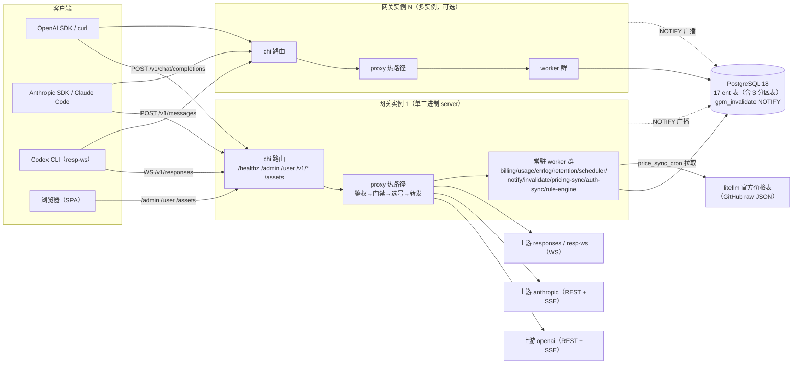
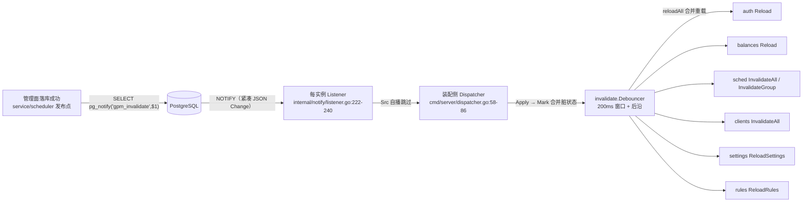

# go-proxy-mini 架构拓扑（标准文档）

> 受众：vibecoding agent（改热路径/加表/加 worker/接线前必读）+ 新贡献者 onboarding。
> 基准：main HEAD `56e2836`（err_logs 合并后）。所有代码锚点均基于该 commit 的 worktree 核实。
> 约定：本文档只陈述 main 现状；**合并中**的项（#13 快照注册表）单列"进行中"节引用其 spec，不虚构已合并态。
> 详细 API 契约见 `docs/admin-api.md` 与 `openapi/openapi.yaml`，本文不重复。

## 1. 系统概览

- 单二进制部署：前端 `web/` 构建产物经 `cmd/server/embed.go:10` 的 `go:embed all:dist` 内嵌进 Go 二进制；运行时 = `server` 进程 + 挂载 config（Dockerfile 三阶段：node → go → alpine 非 root）。
- 部署面（一句话带过）：
  - `deploy/compose.yml`：`db`（postgres:18-alpine，目录挂载 ./data/pg）+ `app`（单容器，`GPM_ADMIN_TOKEN`/`GPM_DB_DSN` 环境变量注入，config.toml 只读挂载）。
  - `Dockerfile`：多阶段构建，`CGO_ENABLED=0` 静态单二进制。
  - `scripts/build.sh`：pnpm 构建 web → 拷入 `cmd/server/dist` → `go build -o bin/server`。
  - `tools/`：`tools/loadtest`（打压测，-mode stream/fill，交错跑 + 每请求 CPU）、`tools/fakeupstream`（假上游，chunks/latency 可配）、`tools/e2e`（端到端计费测试）。

## 2. 模块地图

`internal/` 每包一行职责 + 依赖方向。**禁止反向**的约束单独标注。

| 包 | 职责 | 依赖（被谁依赖） |
|---|---|---|
| `internal/config` | TOML 加载 + env 覆盖（`GPM_*`） | main 入口 |
| `internal/server` | chi 路由装配：/healthz、/admin 鉴权中间件、/user 分流、AI Mount、SPA fallback | main |
| `internal/handler`（+`/user`） | 管理面 API（openapi 生成）+ 用户面 API | 依赖 service/repository |
| `internal/service` | 业务层：settings/pricing 快照（`internal/service/service.go:251,255`）、变更发布 `publish`（`internal/service/service.go:281`）、ClusterInstances | 依赖 repository/notify/invalidate/rule |
| `internal/repository` | ent 持久化门面，只暴露 domain 类型（`internal/repository/repository.go:13`）；分区表 DDL 独占管理 | 被所有上层依赖 |
| `internal/proxy` | **请求热路径**：鉴权/门禁/限流/选号/转发/用量路由 | 依赖 scheduler/rule/auth/credential/billing/usage/aiclient/protoconv |
| `internal/scheduler` | 账号调度：快照/预生成路由/并发槽/异步状态回写 | 依赖 rule/credential；**不 import notify**（发布面接口化，`cmd/server/dispatcher.go:10-14` 装配侧粘合） |
| `internal/rule` | 规则引擎：事件队列 worker（Name="rule-engine"）+ 状态动作 apply | scheduler 注入 apply 回调 |
| `internal/credential` | 凭据类型注册表 + Provider 分发（api_key/responses-special/codex-oauth/codex-pat，`internal/credential/credential.go:29-46`） | proxy/scheduler 消费 |
| `internal/auth` | JWT issuer/verify + RequireJWT 中间件 | server/user handler |
| `internal/billing` | 计费：价格矩阵纯函数、余额快照、批量扣费 Flusher | proxy/repository |
| `internal/usage` | 明细 Recorder、err_logs 落盘 worker、retention worker | proxy/billing/repository |
| `internal/notify` | 多实例 NOTIFY 发布/监听（`Change` 载荷 + Dispatcher 接口） | main 装配（service/scheduler 发布） |
| `internal/invalidate` | 管理面变更去抖定向失效（Debouncer） | main 装配；service 作 Invalidator |
| `internal/pricing` | litellm 价格表拉取 + cron 同步 worker | service/repository |
| `internal/protoconv` | 协议转换（四方向，纯标准库） | proxy（convertedCaller） |
| `pkg/aiclient` | openai/anthropic 官方 SDK 唯一引用点（客户端懒构建工厂） | proxy |
| `pkg/httpx` | 共享上游 http.Transport（连接池参数） | main → aiclient/pricing |
| `pkg/sserelay` | 字节级 SSE relay（帧原样透传 + Observer 旁路） | proxy 流式路径 |
| `pkg/cryptox` / `pkg/logx` | key 哈希 / 结构化日志 | 各处 |

装配链（`cmd/server/main.go:42-340`）：config → logx → PG 池（`OpenPG` + `stdlib.OpenDBFromPool` 桥接，`cmd/server/main.go:68`）→ ent → 分区 bootstrap（`cmd/server/main.go:80-88`）→ notify Publisher（`cmd/server/main.go:99`）→ ruleEngine/scheduler/rec/errlogW/retention（`cmd/server/main.go:102-131`）→ proxy.Auth → aiclient 工厂 → invalidate Debouncer（`cmd/server/main.go:185-193`）→ service → dispatcher（`cmd/server/dispatcher.go:34-41`）→ notify listener（`cmd/server/main.go:212-217`）→ authSync → billing Flusher + BillingHooks（`cmd/server/main.go:222-234`）→ proxy.New（`cmd/server/main.go:235-243`）→ `SetInstancesProvider(svc)`（`cmd/server/main.go:247`）→ pricing SyncWorker（`cmd/server/main.go:254-260`）→ handler/aiRouter/userHandler/server.New（`cmd/server/main.go:261-278`）→ worker.Manager 注册 + StartAll（`cmd/server/main.go:289-303`）→ HTTP 监听（`cmd/server/main.go:309-320`）→ 优雅停机链（`cmd/server/main.go:322-339`）。

依赖约束（改代码前先看）：
- **notify 不 import invalidate/service**（`internal/notify/listener.go:15-16`）；**scheduler 不 import notify**（`cmd/server/dispatcher.go:10-14`）——跨层发布全部接口化，由 cmd/server 装配侧粘合。
- **proxy 不 import server/handler**；handler 不 import proxy（AI 端点经 `proxy.AIRouter` 在 main 装配）。
- **repository 不依赖任何业务包**（domain 类型下沉）。
- ent schema 文件名 snake_case 对照（勿混淆）：`internal/ent/schema/account_ext.go`↔包 `accountext`、`group_assignment.go`↔`groupassignment`、`template_ext.go`↔`templateext`、`redemption_code.go`↔`redemptioncode`、`redemption_use.go`↔`redemptionuse`、`temp_balance.go`↔`tempbalance`、`usagelog.go`↔`usagelog`、`usagestat.go`↔`usagestat`、`errlog.go`↔`errlog`（`internal/ent/schema/` 共 17 个文件）。

## 3. 请求热路径

**入口**：`internal/server/server.go:110-115` AI 组 `Mount("/")` + inflightLimiter → `internal/proxy/router.go:15-39` 路径决定格式（chat/completions、responses、messages；responses 带 upgrade 头 → WS 编排 `internal/proxy/caller_responses_ws.go:60`）。

**骨架**（`internal/proxy/caller.go:100-385` `handleFormat`，顺序即纪律）：

```mermaid
flowchart LR
    A["Authenticate<br/>internal/proxy/auth.go:120"] --> B["QuotaExhausted<br/>本地预算快读 internal/proxy/gate.go:263"]
    B --> C["余额预检<br/>BalanceOf 快照 internal/proxy/caller.go:128-142"]
    C --> D["Acquire 两级并发门禁<br/>internal/proxy/gate.go:215"]
    D --> E["固定窗口限流 Allow<br/>internal/proxy/limit.go:35"]
    E --> F["读体 + json.Valid +<br/>gjson 提 stream/model/tier<br/>internal/proxy/caller.go:160-215"]
    F --> G["sched.Select 选号<br/>（含协议转换补差）"]
    G --> H["failover 循环<br/>credentialFor + caller.Call"]
    H --> I["finish/record：<br/>Release + DeductQuota +<br/>计费 + routeLog 路由"]
```

每个决策点：
- **鉴权**（`internal/proxy/auth.go:120-141`）：`Authorization: Bearer` 或 `x-api-key`（Anthropic 口径）→ `cryptox.HashKey` → 快照查（零 DB）；key 或归属用户禁用 → 401 即时失效。
- **认证双路径**（`internal/server/server.go:66-104`）：/admin 组 = 静态 admin token `Bearer <AdminToken>` **OR** platform_admin JWT（`JWTIssuer.Verify` + `claims.Role==platform_admin` + 快照用户状态 active 校验；JWT 路径注入 `adminUserIDKey`）；/user 组 = 内部公开分流（`internal/handler/user/router.go:22-40`：register/login 公开，其余 RequireJWT）；AI 组 = key 鉴权（无 JWT）。
- **配额**：`QuotaExhausted`（`internal/proxy/gate.go:263-279`）本地预算两原子读；耗尽才触发 DB 复核认领（`internal/proxy/gate.go:316-364`，慢路径单飞 + 10s 失败退避）；复核公式 `budget = consumed + ceil(remaining_eff/N)`（#37 P1 收敛修正，防复核无限续额）。
- **余额预检**（`internal/proxy/caller.go:128-142`）：快照读零 DB（滞后 ≤ balance_refresh_interval）；快照缺失/≤0 且非免费组 → 402；免费组（EffectiveMultiplier==0）放行。
- **并发门禁**：user → key 两级 CAS（`internal/proxy/gate.go:215-240`），key 失败回滚 user 计数；跨 reload 在途值继承。
- **限流**：`internal/proxy/limit.go:35-49` 固定窗口 `ceil(group_key_rpm/N)`；`cooldown_429/backoff_*` 已废弃（`config.example.toml:23-24` 注释）——429 冷却与错误退避由规则引擎（种子 + `/admin/rules` 自定义）接管。
- **选号**：`internal/scheduler/selection.go:13-41` tier1（模型偏好 Serves）→ tier2 → 默认桶；预生成加权轮询序列（零热路径计算）；协议转换只补差（`internal/proxy/caller.go:36-56`，off 零开销）。
- **流式透传**：aiclient 流式入口经 `pkg/sserelay` 字节级 relay + Observer 旁路提取 usage；WS 1:1 透传（`internal/proxy/caller_responses_ws.go:236`）。
- **usage 计费**：`finish`（`internal/proxy/forward.go:100-109`）→ `routeLog`（`internal/proxy/forward.go:250-262`）分表路由——放行行（error_type ∈ {none, abort}）billed → Flusher / 非 billed → rec.Record；失败行只聚合统计 + err_logs。

**热路径纪律**（改这里先读）：
1. 热路径**零 DB、零 per-request 锁**（`internal/proxy/forward.go:1-3` 包注释）；所有快照读 = 内存原子（atomic.Pointer / RWMutex 读锁 / CAS）。
2. **开关关闭 = 快照读 + 分支**：`protocol_convert=off` 不触达 protoconv（`internal/proxy/caller.go:225`）、`strip_image_tools` 关 = 布尔读 + 分支（`internal/scheduler/selection.go:70`）、billing off = `shouldBill` 恒 false（`internal/proxy/forward.go:114-116`）。
3. **开关开启 = bytes.Contains 预筛零解析**：W4 图像 tool 剥离 `internal/proxy/strip_image.go` 预筛（无 "image" 子串零解析，压测 ~1.5% QPS 差异）；W5 转换走 gjson 预筛 + Raw 零拷贝（`internal/protoconv/jsraw.go:1-9`）。
4. **永不阻塞投递**：usage.Record（`internal/usage/usage.go:168-187`）、billing Flusher.Record（`internal/billing/flusher.go:152-169`）均为无 channel 的锁内归并；errlog 投递 select-default 非阻塞丢弃（`internal/usage/errlog.go:152-171`）。

## 4. 协议适配面

四格式（`internal/domain/types.go:11-17`）：`openai-chat` / `openai-responses` / `openai-responses-ws` / `anthropic`。

| 格式 | 入口 | caller | 流式 |
|---|---|---|---|
| chat | `POST /v1/chat/completions` | `internal/proxy/caller_chat.go` | SSE relay |
| responses | `POST /v1/responses` | `internal/proxy/caller_responses.go` | SSE relay |
| responses-ws | `WS /v1/responses`（upgrade 头判定，`internal/proxy/router.go:21-35`） | `internal/proxy/caller_responses_ws.go:60` | 原生 WS 1:1 |
| anthropic | `POST /v1/messages` | `internal/proxy/caller_anthropic.go` | SSE relay |

pkg 职责边界：
- `pkg/aiclient`（`pkg/aiclient/aiclient.go:1-15`）：**openai/anthropic 官方 SDK 的唯一引用点**——客户端懒构建 + 鉴权头注入（格式决定头名：openai → `Authorization: Bearer`、anthropic → `x-api-key`）+ 非流式超时；协议类型（params/response/stream）直接透传为调用签名（"用现成库"原则，不重写协议）。
- `pkg/httpx`：共享 `http.Transport`（连接池参数：max_idle_conns 8192、per_host 2048、force_http2，`config.example.toml:15-21`）；openai-go/anthropic-sdk 共用同一 `*http.Client`（`cmd/server/main.go:135-141`）。
- `pkg/sserelay`：字节级 SSE relay——增量读帧原样转发 + 自适应批量 Flush + Observer 旁路（仅 usage 提取，不参与转发决策；`pkg/sserelay/relay.go:1-12`）。
- 凭据抽象 `internal/credential`：Provider 只返回凭据值，不感知请求格式（`internal/credential/credential.go:7-11` 正交原则）；未知类型显式报错不静默 fallback（`internal/proxy/forward.go:528-535`）。

加新格式 = 1 个 caller 文件 + `internal/proxy/forward.go:70-74` 注册表一行 + router.go 一个端点（`internal/proxy/forward.go:68-69` 注释）。

## 5. 协议转换层（internal/protoconv）

- 边界（`internal/protoconv/protoconv.go:1-9` 包注释）：**纯标准库**（encoding/json），与 OpenAI/Anthropic SDK 零耦合；按 `groups.protocol_convert` 快照值分派（off 不经过本包——热路径分支在 proxy 判定）；WS 帧流转换不做（resp-ws 1:1 透传）。
- 四方向（`internal/protoconv/protoconv.go:23-50`）：`ConvertRequest`（chat→resp / mess→resp / resp→mess / chat→mess）+ `ConvertResponse`（非流式）；`NewStreamMapper`（流式 SSE 事件映射，`internal/protoconv/protoconv.go:56-71`）。
- **字节级纪律**（`internal/protoconv/jsraw.go:1-9`）：gjson 预筛（`gjsonKeyEq` 长度校验 + 逐字节比较零分配）→ `gjson.Result.Raw` 零拷贝切片直接拼入输出 → 单缓冲复用（`StreamMapper` 的 buf/dbuf，`internal/protoconv/protoconv.go:90-103`；帧返回后下一帧覆盖，调用方不得跨帧保留）；chat→resp 方向字节级组装，其余方向 map 组装（`EncodeFrame`）。
- 缺名帧处理（P3 教训）：无 `event:` 名帧从 data 的 `type` 字段推断（`internal/protoconv/protoconv.go:106-121` `inferEventName`），无法推断原样透传。
- 转换 on/off 开销实证（`docs/superpowers/plans/2026-08-11-w3-loadtest.md` §二 与 `docs/superpowers/plans/2026-08-11-protoconv-opt-loadtest.md` §一，均压测机（内部环境，IP 存部署清单） 实证）：
  - w3 历史：on 相对 off = QPS **-16.4%**、每请求 CPU **+32%**（+71.5µs）、首字节 **+34ms**。
  - 字节级优化后（请求 274→6 allocs、流式逐帧 59→1.1 的 benchmark 声明）：QPS 差距收敛至 **-10.9%**（52.3k→46.6k）、CPU **+17.8%**（+41.4µs）、首字节 **+21ms**；pprof 转换路径占比 22.6% → 8.5%。
  - off 基线无回退（52.3k / 232.8µs，与 w3 off 同量级）——"off 热路径零开销"保持成立。

## 6. 数据模型

**17 张 ent 表**（`internal/ent/schema/` 17 个文件，表名常量在 `internal/ent/<pkg>/<pkg>.go`）：

| 表 | schema 文件 | 说明 |
|---|---|---|
| accounts | account.go | 上游账号（status/cooldown/max_concurrency/weight + template_id） |
| account_exts | account_ext.go | 账号类型化扩展（codex oauth/pat 凭据） |
| groups | group.go | 组（倍率、protocol_convert、key 限制） |
| group_assignments | group_assignment.go | 用户-组关联（专属倍率） |
| keys | key.go | 网关 key（hash/quota/quota_used/concurrency） |
| pricings | pricing.go | 模型价格（source 行级互斥 manual > litellm） |
| redemption_codes / redemption_uses | redemption_code.go / redemption_use.go | 兑换码 + 使用记录 |
| rules | rule.go | 规则引擎表（种子 + 自定义） |
| settings | setting.go | 内置设置注册表（`internal/domain/settings.go:10-38` 类型化 key） |
| temp_balances | temp_balance.go | 临时额度（FEFO 扣费） |
| templates / template_exts | template.go / template_ext.go | 模板 + 类型化扩展（strip_image_tools 等开关） |
| users | user.go | 用户（balance/status/concurrency） |
| **usage_logs** | usagelog.go | 计费明细（**分区表**） |
| **err_logs** | errlog.go | 错误审计明细（**分区表**） |
| **usage_stats** | usagestat.go | 聚合统计（**分区表**） |

另：`accounts`↔`groups` 多对多隐式 join 表 `account_groups`（`internal/ent/account/account.go:58`）。

**三表分区**（`internal/repository/partition.go`，单一实现三表共用）：
- 分区键：usage_logs/err_logs = `created_at`；usage_stats = `bucket_time`（小时桶 24 桶/日分区）。主键 `(id, 分区键)`（分区表硬约束），id 走专用序列 `{table}_id_seq`，DROP TABLE 级联回收（`internal/repository/partition.go:33-36`）。
- 保留期（`config.example.toml:34,46-49` + `cmd/server/main.go:122-131`）：usage_logs **30 天**、err_logs **7 天**（错误审计短保留）、usage_stats **180 天**（聚合长保留）——**全部 DROP 分区 O(1)**（PG DELETE 不释放空间，用户裁决），retention worker 每小时巡检按名 DROP + 预建当日/明日分区。
- ent migrate 跳过分区表（`internal/repository/partition.go:486-508` `migrateHookExcludesPartitioned`——atlas 对分区表 diff 规划期必失败，真实 PG 实测结论）；表 DDL/索引/补列由 bootstrap 独占管理（`ensureTablePartitioned` `internal/repository/partition.go:329-364`，幂等 + 42P07/23505 容忍多实例并发）。
- 关键索引（`internal/repository/partition.go:139-145,177-181,218-221`）：usage_logs `(created_at)` + `(group_id/account_id/user_id/key_id, created_at)`；err_logs `(created_at)` + `(group_id/user_id, created_at)`；usage_stats 唯一索引 `(bucket_time, group_id, account_id, template_id, user_id, model, is_error)`（即 Upsert 冲突目标）。

## 7. 快照与注册表层级

**main 现状**：各模块自管快照，形态 = atomic.Pointer 整表换入（读端零锁）或 RWMutex + 锁内换 map：

| 快照 | 实现 | 刷新源 |
|---|---|---|
| auth（key/user 元数据 + gate 计数） | `internal/proxy/auth.go:61-81` Reload，锁内整体换 | invalidate Users/Keys + authSync 60s 周期兜底 + 启动 |
| scheduler（组/账号/路由 + 并发槽） | `internal/scheduler/scheduler.go:89-99` snapshotStore | invalidate 全量/组级 + 30s syncLoop ticker |
| rules（规则表） | `internal/rule/engine.go:85` | invalidate Rules + 启动显式 Reload（`cmd/server/main.go:284`） |
| pricing（模型价格） | `internal/service/pricing.go:35-71` | ReloadPricing（sync 成功/管理端改价后），**不进 invalidate**（`internal/invalidate/invalidate.go:22` 注释） |
| balances（余额 + 倍率） | `internal/billing/balances.go:43-48`（atomic.Pointer，Set 原地 Store） | invalidate Users/Multipliers + BalanceRefreshInterval ticker（`internal/billing/flusher.go:134-145`） |
| settings | `internal/service/service.go:251` | invalidate Settings + 启动 |
| credential.Registry | `internal/credential/credential.go`（类型注册表 + Provider 分发，无快照语义） | 静态注册 |

**notify.Dispatcher 接口**（`internal/notify/listener.go:20-30`）：`Apply(Change)` + `FullRefresh()`；实现放装配侧 `cmd/server/dispatcher.go:34-41`（notify 不 import invalidate 的依赖环约束）。

> **进行中（#13，未合并入 main）**：快照注册表 `snapshot.Registry`——统一快照生命周期（启动就绪 + scope 精确变更分发 + 状态追踪）。契约见 `docs/superpowers/plans/2026-08-11-snapshot-registry-spec.md`。要点：注册表只持有 Name/Scope/LastReload 元数据，不接管模块 ticker、不缓存快照数据、不进请求热路径；ReloadAll 仅启动就绪专用，运行时变更一律走 scope 精确路径。**本文 §3/§9 的事件流仍为 main 现状**（去抖器 + NOTIFY 分发），不得按注册表语义改写。

## 8. worker 拓扑

统一契约 `worker.Worker`（`internal/worker/worker.go:13-19`：Name/Start/Close 均幂等，Close 未 Start 也安全）；`worker.Manager` 顺序启动、**反向排空**、panic 捕获（`internal/worker/worker.go:38-89`）。

注册顺序与反向排空（`cmd/server/main.go:289-300`）：`inv → sched → ruleEngine → rec → errlogW → pricingSync → retention` →（billing 开后）`billFlusher` → `listener, authSync`。停机时反向：listener/authSync 先关（旁观者）→ billFlusher（最后一个产生计费流量的 worker，扣费全量落库）→ errlogW → rec → rule → sched。

| worker | Name | 类型 | 节奏/背压 | 排空/停机语义 |
|---|---|---|---|---|
| billing.Flusher | "billing"（`internal/billing/flusher.go:118`） | ticker 批量 | `flush_interval`（1s）+ `balance_refresh_interval`（10s）；无 channel，pending map 锁内归并，`Record` 永不阻塞（`internal/billing/flusher.go:152-169`）；水线 1M 行 Warn | Close：等在途批次（flushMu）→ 预算内排空循环，超时 Cancel baseCtx 截断 Warn（`internal/billing/flusher.go:181-226`）；O1 复测教训：Background ctx 会拖死停机 |
| usage.Recorder | "usage"（`internal/usage/usage.go:146`） | 双 loop（明细 + 统计） | `flush_interval` 500ms / `stats_flush_interval` 10s；swap 换批 + 按 userID 分片 N worker（`internal/usage/usage.go:316-392`）；毒丸行止损 `maxLogFlushFailures=5`（`internal/usage/usage.go:363-375`）；同 flushMu 与统计 flush 互斥（评审 I-1 耦合注记） | 同 Flusher 模式：等在途 → 预算排空 → 截断 Warn（`internal/usage/usage.go:576-629`） |
| usage.ErrLogWorker | "errlog"（`internal/usage/errlog.go:105`） | 双队列 + ticker | 有界队列（reject 4096 / exempt 1024）+ select-default 非阻塞投递（满→丢弃计数，`internal/usage/errlog.go:152-171`）；豁免队列恒落盘；单批 500 行 / 500ms，单批超时 5s 失败即丢弃（`internal/usage/errlog.go:47-49,184-190`） | Close：置位 closed（无尾窗口静默丢）→ 等 loop → 预算内排空，超时截断并入丢弃计数（`internal/usage/errlog.go:236-287`） |
| usage.RetentionWorker | "retention"（`internal/usage/retention.go:65`） | ticker 1h | 三表独立 cutoff 各自 DROP + 预建当日/明日；逐表错误隔离（`internal/usage/retention.go:97-148`） | 无排空需求（DROP/预建均幂等），Close 直接 nil（`internal/usage/retention.go:151`） |
| scheduler | "scheduler"（`internal/scheduler/scheduler.go:117`） | syncLoop + writebackLoop 双 goroutine（`internal/scheduler/scheduler.go:120-127`） | sync `sync_interval` 30s；writeCh 有界 4096 满则丢弃 DB 回写（`internal/scheduler/scheduler.go:660-666`，内存状态已生效） | Close 排空 writeCh 剩余回写，预算超时 Warn 丢（`internal/scheduler/scheduler.go:131-152`） |
| notify.Listener | "notify"（`internal/notify/listener.go:123`） | 事件驱动（阻塞 WaitForNotification） | 独立单连接 LISTEN gpm_invalidate；断线指数退避 1s→30s + 重连全量刷新 | Close 取消 + 等 goroutine（阻塞点均响应 ctx，`internal/notify/listener.go:161-175`） |
| invalidate.Debouncer | "invalidate"（`internal/invalidate/invalidate.go:230`） | 事件驱动单 goroutine | 200ms 去抖窗口 + 后沿语义（执行期新变更立即再执行，`internal/invalidate/invalidate.go:277-287`）；重载串行不重叠 | Close nil（停机不补最后 flush——DB 权威，`internal/invalidate/invalidate.go:249`） |
| pricing.SyncWorker | "pricing-sync"（`internal/pricing/worker.go:74`，构造 `internal/pricing/worker.go:63`） | 启动异步一次 + cron | `price_sync_cron`（默认 `0 3 * * *`）gronx 调度；每轮现读 settings；非法 cron 1h 重试 | 无资源需排空，Close nil（`internal/pricing/worker.go:90`） |
| cmd/server.authSync | "auth-sync"（`cmd/server/auth_sync.go:38`） | ticker 60s | 周期全量 Reload auth 快照（NOTIFY 丢失兜底，`cmd/server/auth_sync.go:13-16`） | Close nil（循环随 ctx 退出，`cmd/server/auth_sync.go:64`） |
| rule.RuleEngine | "rule-engine"（`internal/rule/worker.go:15`） | 事件队列 | 有界 channel 满则丢弃（dropped 计数 + 告警，`internal/rule/worker.go:82-83`） | Flush 同步排空（测试/优雅关闭用，`internal/rule/worker.go:42-47`） |

**flush_workers 分片语义**（`config.example.toml:36-39` + `cmd/server/main.go:113`）：`flush_workers=4`（建议上限 ~7，受 db.max_conns 余量约束）——批内按 userID 取模分片（`internal/billing/flusher.go:269-277`）/按 bucket key FNV-1a 哈希分片（`internal/usage/usage.go:245-273`），**同 key 恒同桶**（分片确定性）；分片并行非常驻 goroutine（每批新建，wg.Wait 收尾），**不是**常驻 worker。

## 9. 事件流（main 现状链）

- **发布**（`internal/notify/publisher.go:99-128`）：DB 写成功后 `Publish`；载荷守卫——marshal >6KB 丢 Groups 降级 Templates（full 重载，`internal/notify/publisher.go:36-38,74-82`）；**计费扣费路径绝不发布 NOTIFY**（每 flush 即风暴，`internal/notify/publisher.go:16`）；scheduler 状态回写成功后发组级 NOTIFY（`internal/scheduler/scheduler.go:226-232` + `cmd/server/dispatcher.go:16-18` adapter）。
- **监听**（`internal/notify/listener.go:85-91,222-240`）：独立单连接（非池连接——池连接会被 idle 回收导致订阅静默丢失，`internal/notify/listener.go:57-63`）；消费 → Unmarshal → Src 自播跳过（`internal/notify/listener.go:233-235`）→ `Dispatcher.Apply`；断线指数退避重连 + 连接成功立即 `FullRefresh`（覆盖断连期间丢失，`internal/notify/listener.go:203-206`）。
- **分发映射**（`cmd/server/dispatcher.go:58-86`）：Users → auth+余额全量；Templates → sched 全量 + clients 失效；Groups(±Clients) → sched 组级定向（upstream_key 变更带 clients 失效）；Clients 独立 → 仅客户端工厂失效；Multipliers → 余额倍率定向；Keys → auth 全量；Settings → settings 重载；Rules → 规则表全量重载（重载清窗口计数，全实例同步语义）。
- **去抖**（`internal/invalidate/invalidate.go:129,251-287`）：Mark 路径零锁零 DB（atomic CAS 合并 + 非阻塞唤醒）；200ms 窗口自首次变更计时，到点 flush 一次合并重载；后沿语义（完成后再脏立即再执行）。读端永不阻塞：重载单 goroutine 串行。
- **多实例广播语义**：每实例一个 Listener，同一 NOTIFY 全实例接收 → 各自去抖窗口执行（含发布实例自身，自播仅跳过 Src==自己）；全实例最终收敛（幂等重载 + DB 权威）。

> **进行中（#13）增量**：NOTIFY 处理路径将按 scope 精确分发到快照注册表（`registry.Reload(ctx, scopes...)`），settings 变更补触发 auth/gate 预算重算等 #36 缺口；**合并前本文事件流 = 上述 main 现状链**，细节以 spec 为准。

## 10. 多实例一致性

- **并发扣费**（`internal/repository/billing_repo.go:69-139`）：`DeductAndLog` 单事务——① FEFO 临时额度按 expires_at 升序逐行条件更新（`amount >= take` 行级防并发透支，NULL 最后即 NULLS LAST）；② 余额条件更新（`balance >= remain`），0 行 → 无条件扣允许透支，再 0 行 = 用户不存在跳过扣减仍插日志；③ 事务内回读 balanceAfter。行锁仲裁跨实例天然串行（`docs/superpowers/plans/2026-08-10-multi-instance-design.md` §1 表）。
- **同 user 恒同桶串行分片**（`internal/billing/flusher.go:269-277`）：按 userID 取模分片 → 实例内同 user 串行；跨实例靠 DB 行锁。
- **NOTIFY 跨实例**（§9 全链）：实例 ID = hostname-pid（`cmd/server/main.go:94-99`），同主机多实例 pid 不同不碰撞；Src 自播跳过。
- **额度预算分摊**（`internal/proxy/gate.go:51-87`）：`budget = consumed + ceil(remaining_eff/N)`，N 存 DB settings `cluster.instances`（`internal/domain/settings.go:25-27`，config 文件可漂移故 DB 是唯一共识源）；N 变更走 settings NOTIFY → 装配侧重调 `SetInstancesProvider` 即时重算（`cmd/server/main.go:247`）；组 RPM 同款 `ceil(rpm/N)`（`internal/proxy/limit.go:9-12`）。
- **分区 DROP 幂等**（`internal/repository/partition.go:292-303,329-364,391-421`）：IF NOT EXISTS / IF EXISTS + 42P07/23505 容忍——多实例并发 bootstrap/预建/清理收敛；retention DROP 需 ACCESS EXCLUSIVE 锁与在途插入串行（`internal/usage/retention.go:45-49` 评审 I-3 注记）。
- **已知接受的竞态**（`docs/superpowers/plans/2026-08-10-multi-instance-design.md` §R2）：NOTIFY 重复投递 → mark 幂等合并；`UpdateAccountStatus` 并发 → last-writer-wins；stats Upsert 同桶累加精确；规则种子双写 → 唯一约束幂等；pricing sync 每实例独立 cron 重复 fetch（v1 接受）。

## 11. API 面

路由清单（详细契约见 `docs/admin-api.md` + `openapi/openapi.yaml`，不重复）：

| 路由 | 鉴权 | 说明 |
|---|---|---|
| `GET /healthz` | 无 | inflight/goroutines/heap（`internal/server/server.go:56-64`） |
| `/admin/*` | 静态 admin token OR platform_admin JWT（`internal/server/server.go:66-104`） | 管理面（chi Handle，`internal/server/server.go:97-102`） |
| `/user/*` | register/login 公开，其余 RequireJWT（`internal/handler/user/router.go:22-40`） | 用户面 |
| `Mount("/")` | AI key 鉴权（proxy） | chat/anthropic/responses + WS（`internal/proxy/router.go:15-39`） |
| `/assets/*`、`/favicon.svg`、`/`、SPA fallback | 无 | 网关内嵌 web/dist（`internal/server/server.go:117-150` + `cmd/server/embed.go:10-15`） |

- admin 组（`internal/handler/api.gen.go:3349-3502`，openapi 生成）：`/accounts`（含批量 batch-delete/batch-update、`{id}/ext`、`{id}/groups`）、`/groups`（含 assignments）、`/users`（含 `{id}/groups`）、`/templates`（含 batch、`{id}/ext`）、`/keys`、`/pricing`（含 `/pricing/sync`、`/pricing/{model}`）、`/rules`、`/settings`、`/redemption-codes`（含 batch-deactivate、`{id}/deactivate`、`{id}/uses`）、`/usage_logs`、`/err_logs`、`/stats`。
- user 组（`internal/handler/user/api.gen.go:1282-1324`）：`/user/auth/login|register|me`、`/user/keys`（含 `{id}`、`{id}/rotate`）、`/user/groups`、`/user/usage_logs`、`/user/err_logs`、`/user/stats`、`/user/redemptions`。
- AI 组：`POST /v1/chat/completions`、`POST /v1/responses`（upgrade → WS）、`GET /v1/responses`（仅 upgrade 放行，否则 405）、`POST /v1/messages`（`internal/proxy/router.go:15-39`）。

## 12. 配置面

`config.example.toml` 段落 → 模块映射（对照真实文件，`cmd/server/main.go:42-340` 消费）：

| 段落 | 消费模块 | 关键项 |
|---|---|---|
| `[server]` | server.NewServer + http.Server | addr/read_header_timeout/max_header_bytes |
| `[log]` | logx.New | level/output |
| `[admin]` | server 静态 token | token |
| `[auth]` | jwtauth.Issuer | jwt_secret（`GPM_AUTH_JWT_SECRET` 亦可） |
| `[db]` | repository.OpenPG | dsn/max_conns（20 = billing 4 + stats 4 worker + 余量） |
| `[proxy]` | proxy.New | max_body_size/max_inflight/upstream_timeout/upstream_stream_timeout/failover_attempts/usage_capture |
| `[upstream]` | httpx.TransportConfig | 连接池参数（max_idle_conns 8192 / per_host 2048 / force_http2） |
| `[limit]` | fixedWindowLimiter | group_key_rpm（0 = 关）；**cooldown_429/backoff_* 已废弃**（`config.example.toml:23-24` 注释，规则引擎接管） |
| `[scheduler]` | scheduler.Config | default_max_concurrency/sync_interval |
| `[usage]` | usage.Recorder + ErrLogWorker + RetentionWorker | batch_size/flush_interval/log_retention_days=30/stats_flush_interval/flush_workers=4；errlog_queue_size=4096/errlog_batch_size=500/errlog_flush_interval=500ms/errlog_retention_days=7/stats_retention_days=180 |
| `[billing]` | billing.NewFlusher + BillingHooks | enabled（默认关 opt-in）/flush_interval=1s/balance_refresh_interval=10s/flush_workers=4 |

- 必填校验（`cmd/server/main.go:58-60`）：admin.token、auth.jwt_secret、db.dsn 缺失即 fatal。
- 分区/保留/倍率等策略参数在 **DB settings 表**而非 config（`internal/domain/settings.go:10-38`）：signup 默认资源、price_source_url/price_sync_cron、service_tier_policy_*、cluster.instances。

## 13. 架构决策记录（ADR）

每条 = 用户裁决/评审定稿 + **为什么** + 来源锚点（代码注释位置或 plan 文件名）。

1. **三词原则（性能 / 边界 / 优雅）**——所有方案取舍的评判标准。为什么：压测驱动演化（53k/s 目标）中每个"快"都要有边界（哪些路径不碰）与优雅（停机/失败不丢语义）。来源：`docs/superpowers/plans/2026-08-11-errlog-task.md:5`。
2. **不计费不入 usage_logs**——usage_logs 成员资格按**放行路径语义（error_type ∈ {none, abort}）**判定，与 cost 无关。为什么：cost>0 判定会漏掉免费分组（倍率 0 成功行）与 0 token 成功行（空响应）；失败行（4xx/5xx/network）不入 usage_logs（P2a 拒绝风暴教训：每请求一条明细即无界积压与写放大源头），错误审计归 err_logs。来源：`internal/proxy/forward.go:236-249`（routeLog 注释）+ `docs/superpowers/plans/2026-08-11-errlog-task.md:12`。
3. **表三分**——usage_logs（计费明细 30 天）/ err_logs（错误明细 7 天）/ usage_stats（聚合统计 180 天），三表独立保留期。为什么：错误审计与计费明细生命周期/查询面不同，混表使两边互相拖累（瘦身 + 短保留）。来源：`docs/superpowers/plans/2026-08-11-errlog-task.md:25` + `internal/repository/partition.go:22-31`。
4. **分区 DROP 不 DELETE**——保留清理全部 DROP TABLE O(1)（比逐行 DELETE 快 5~6 个量级）。为什么：50k 并发量级 usage_logs ~4.3 亿行/天，逐行 DELETE 不可行；PG DELETE 不释放空间（usage_stats 180 天清理必须 DROP）。来源：`internal/repository/partition.go:22-31` + `internal/usage/retention.go:40-43` + `config.example.toml:47-49` 注释。
5. **双队列豁免采样**——err_logs 按来源（provenance）分队列：豁免队列（abort/failover 已计费错误）恒落盘，普通队列（401/429/402/400/404 拒绝 + 组限流）风暴采样丢弃。为什么：不可按 error_type 推断来源（Err429/ErrBilling/ErrAuth 在拒绝类与双轨类同时出现）；已计费错误审计价值最高。来源：`internal/usage/errlog.go:10-16` + `docs/superpowers/plans/2026-08-11-errlog-task.md:10,14`。
6. **快照注册表边界（#13 进行中）**——注册表不接管模块周期 ticker、不做数据缓存、不进入请求热路径。为什么：避免双 reload 竞争与热路径锁；快照数据形态与周期刷新保持各模块自管。来源：`docs/superpowers/plans/2026-08-11-snapshot-registry-spec.md` 边界节。
7. **单 worker 批量落盘（err_logs）**——无多 worker 并行必要。为什么：DB 写是瓶颈，写速率由 BatchSize/FlushInterval 钉死有界，采样兜底防积压。来源：`docs/superpowers/plans/2026-08-11-errlog-task.md:23`。
8. **usage_logs 瘦身**——去 error_message + status_code（保留 error_type，值域收敛 none/abort）。为什么：错误排障列由 err_logs 承载，明细表瘦身降写放大；存量库不 DROP 列（bootstrap 只加不减幂等）。来源：`docs/superpowers/plans/2026-08-11-errlog-task.md:13` + `internal/repository/partition.go:102-104`。
9. **锁顺序一致化防死锁（P3）**——批量 upsert 批内按 model 排序 + 40P01 重试。为什么：多实例并发同批 model 取锁顺序交错 → deadlock detected（压测启动期偶发）；排序消除主因，重试兜底残余。来源：`internal/repository/pricing_repo.go:29-46,100-112`（#37 P3'）。
10. **ent migrate 跳过分区表**——分区 DDL 由 bootstrap 独占管理。为什么：atlas 对分区表 diff 规划期必失败（真实 PG 实测，ent v0.14.6 + atlas v0.36.2 + PG18）。来源：`internal/repository/partition.go:486-508`。

## 14. 性能基准

- **目标与实测**（`docs/superpowers/plans/2026-08-11-w3-loadtest.md` §一，压测机（内部环境，IP 存部署清单） / 24 逻辑 CPU / 62GB，DB postgres:18 同机，loadtest 工具交错跑 + 每请求 CPU 同口径）：
  - 目标 **53k/s**；实测 10k 并发 **56.3k** total QPS（billing off）/ 50.8k（billing on）、20k **53.3k**、25k **59.9k**——均 ≥ 历史峰值 52.3k，无吞吐塌陷（`docs/superpowers/plans/2026-08-11-w3-loadtest.md:31-33`）。
  - 429 为种子 key 池在途门禁分摊（20k 并发 28.3%、25k 37.7%），非缺陷。
- **转换成本数据**：见 §5（off 基线 52.3k / 232.8µs；on 差距收敛 -10.9% QPS / +17.8% CPU；pprof 转换路径 22.6%→8.5%）。W4 strip 预筛 ≈1.5% QPS / ~1% CPU 差异（`docs/superpowers/plans/2026-08-11-w3-loadtest.md:65`）。
- **风暴教训**（压测 2026-08-11 修复链，`internal/repository/pricing_repo.go`/`internal/billing/flusher.go`/`internal/repository/partition.go` 注释 + `docs/superpowers/plans/2026-08-11-errlog-task.md`）：
  - **P1 分区漂移**：price 快照列/ttft_ms 合入后旧分区表缺列 → 新二进制连旧库 INSERT 42703 全停；修复 = bootstrap 幂等补列 ALTER（`internal/repository/partition.go:83-95,357-362`）。
  - **P2 巨批**：单用户积压 1M+ 行 → 单事务 2000+ 分片串行 8 分钟（xact_age 08:02 实证）+ 堆涨 4.6GB；修复 = 单用户拆事务 ≤10k 行/事务（`internal/billing/flusher.go:34-39`）。
  - **P3 缺名帧**：非规范上游缺 `event:` 行 → 流式转换断流；修复 = data `type` 字段推断事件名（`internal/protoconv/protoconv.go:106-121`）。
  - **P2a 拒绝风暴**：单 key 限流 161k req/s → 60s 冲至 9.8M pending 行 / RSS 7.5GB；修复 = 拒绝行不入 usage_logs 明细 + err_logs 有界队列采样（`internal/proxy/forward.go:195-204`）+ 积压续传循环 `backlogDrainBudget`（`internal/billing/flusher.go:41-51`）。
  - **P2b 停机截断**：O1 复测在途批次 Background ctx 令停机拖至分钟级；修复 = baseCtx 可取消 + Close 预算约束截断 Warn（`internal/billing/flusher.go:95-99,181-226`）。
- 测试基座：真实 PostgreSQL（独立库命名 `gpm_test_*` 避开竞争），pgxmock 已废弃（`internal/repository/pg_*_test.go` 全量真实 PG）。

## 15. 给 agent 的纪律清单

改动前逐条对照：

1. **改热路径**（proxy 包）：先读 §3——热路径零 DB 零 per-request 锁；开关关闭 = 快照读 + 分支、开启 = 预筛零解析；投递永不阻塞；每加一步检查是否引入锁/DB/分配。改完必须跑 `go test ./internal/proxy/... -race` + 压测复测（转换 on/off 交错对比，见 §14 方法论）。
2. **加快照/改快照字段**：读 §7——快照形态 atomic 整表换入或 RWMutex 整体换 map；刷新源三选一（invalidate 事件 / 周期 ticker / 启动同步），新增字段必须接一个刷新源 + 在 `cmd/server` 装配（invalidate Config 或 dispatcher 映射）；**#13 合并后**改走 snapshot.Registry 注册（见 spec）。
3. **加表**：ent schema 新文件（snake_case 命名勿混）+ repository 子仓库 + service/handler 接线；**分区表**（usage_logs/err_logs/usage_stats 同型）必须同时改 `internal/repository/partition.go` 列事实源 + 对齐锚测试（`internal/repository/partition.go:97-104` 双向断言纪律，防 P1 复发）+ bootstrap 调用 + retention 配置。
4. **加 worker**：实现 `worker.Worker` 契约（幂等 Start/Close、Close 未 Start 安全）→ `cmd/server/main.go` 注册（注意注册顺序决定反向排空次序：产生流量的 worker 后注册先排空，旁观者最后注册最先关）→ 有背压面时声明背压/丢弃/观测语义（水线或丢弃计数）。
5. **接线（跨包发布/回调）**：读 §9——跨层一律接口化 + cmd/server 装配侧粘合（notify 不 import invalidate、scheduler 不 import notify 是硬约束）；NOTIFY 变更必须进 dispatcher 映射表 + 载荷守卫（>6KB 降级 full）。
6. **计费改动**：读 §10 + ADR 2/3——扣费恒条件 UPDATE（FEFO + 行锁），预检只是软门禁；usage_logs 只收放行路径行；billing.enabled=false 时 `invBalances` 必须保持 nil 接口（防 typed-nil panic，`cmd/server/main.go:173-177`）。
7. **测试基座**：repository/service 测试 = 真实 PostgreSQL（独立库命名 `gpm_test_<任务名>` 避开并行竞争），不用 sqlite/pgxmock；必须 `-race` + gofmt 干净。
8. **流程**：SDD 三件套——spec 先行（`docs/superpowers/plans/` 当日日期命名）→ spec review 通过才派实现 → 实现 → 内容评审（验收标准核对锚点/裁决清单）→ 合并 main（--no-ff）→ 清理 worktree/分支。commit 中文一句话。
9. **文档纪律**：本文档锚点随代码漂移——改代码位置时同步更新 file:line；合并时若 main 已前进需重核锚点（spec 事实纪律 2）。
